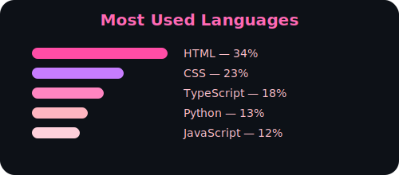
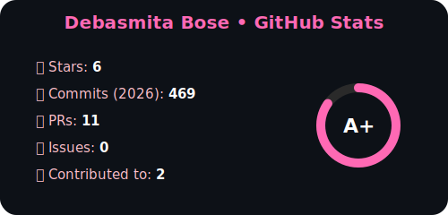
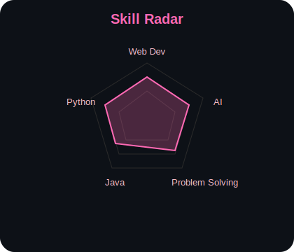
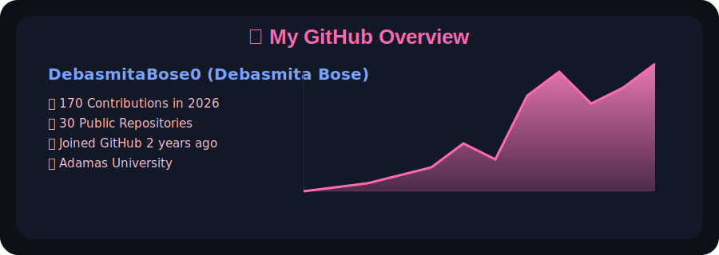

## <h1 align="center">Hi  I am </h1>

  

  

  

  
  
  
  

---

# 
 🪩 About Me

  

## 
 💀 Welcome To This Section Of My Profile 
*💀 Click here if you are brave enough 💀*- https://debasmitabose0.github.io/

## 💫 Quick Snapshot  

- 🧠 Pursuing *B.Tech in Computer Science & Engineering* at **Adamas University**  
- 💡 Passionate about **AI, Data Science, and Web Development**  
- 🔧 Solving *real-world problems through code and logic*  
- 🤝 Believer in *collaboration, adaptability,* and a **growth mindset**  
- 🚀 Open to **internships, projects, and research opportunities**

---

# 
  🛠 Tech Stack  

  <table>
    <tr>
      <th>💻 Languages</th>
      <th>🔧 Tools & Platforms</th>
      <th>🌟 Other Skills</th>
    </tr>
    <tr>
      <td align="center">
         
      </td>
      <td align="center">
         
      </td>
      <td align="center">
        <table>
          <tr>
            <td align="center">🏷 OOP Concepts</td>
            <td align="center">🧩 Problem Solving</td>
          </tr>
          <tr>
            <td align="center">🤝 Teamwork</td>
            <td align="center">🔄 Adaptability</td>
          </tr>
            <td align="center">🌐 Web Development</td>
            <td align="center">🗣️ Communicating is my power</td>
        </table>
      </td>
    </tr>
  </table>

---

# 
  📈 GitHub Stats & Activity  

## 🔥 GitHub Streak

  

## 📊 Top Languages

  

## 🏆 GitHub Profile Stats

  

## 🐍 Contribution Snake Graph  

## ⚡🧠 Skill Matrix and Skill Radar — Always Leveling Up

  

🧠 *Every commit adds experience to this skill tree — just like an RPG character.*

---

## ✨ GitHub Overview ✨

  

---

## 🔥 My Active Contribution Graph

  

---

# 🤝 Connect With Me  

  
  
  

---

  

  

---
